<h3><code>kesi@github ~ $ whoami --info</code></h3>

<!-- hero: monochrome ASCII portrait beside neofetch info card -->
<table>
<tr>
<td valign="top"></td>
<td valign="top"></td>
</tr>
</table>

 

<h3><code>kesi@github ~ $ ./wordmark.sh --3d</code></h3>

 

<h3><code>kesi@github ~ $ ./contributions.sh</code></h3>

<!-- animated contribution graph: real data -->

 

<h3><code>kesi@github ~ $ ./links.sh</code></h3>

<b>Hardware · Software · AI Engineer</b>

